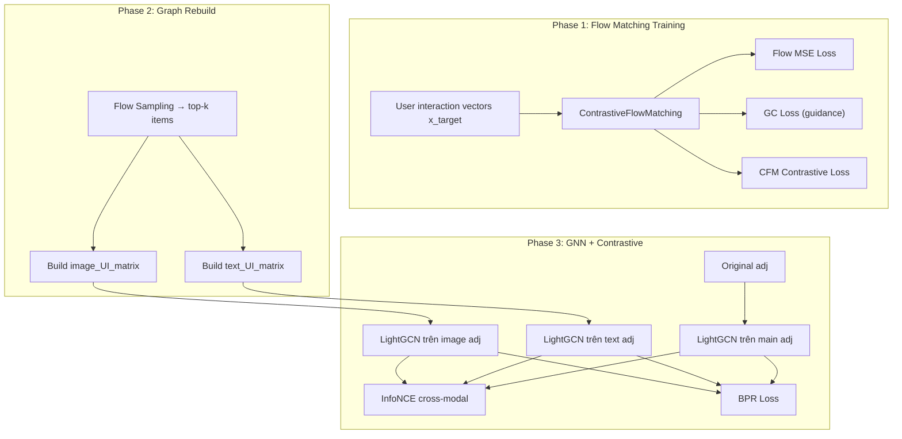
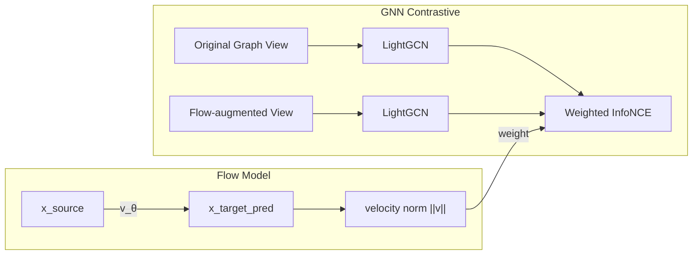

# Hướng Đi Mới cho Contrastive Flow Matching trong Multimodal Recommendation

## Phân Tích Kiến Trúc Hiện Tại

### Tổng quan DiffMM hiện tại

Hệ thống hiện tại có **3 thành phần chính** hoạt động tương đối **độc lập**:



### Điểm yếu / Hạn chế của thiết kế hiện tại

| Vấn đề | Chi tiết |
|:---|:---|
| **Decoupled training** | Flow matching (Phase 1) và GNN recommendation (Phase 3) train riêng, gradient không chảy xuyên suốt |
| **Contrastive trên velocity direction** | CFM loss hiện tại chỉ align hướng velocity $v_\theta$ vs $v^*$ → chưa leverage semantic structure |
| **Source distribution** | $x_0 = x_{\text{target}} + \epsilon \cdot \sigma$ — source gần như trùng target, flow gần trivial |
| **Không cross-modal flow** | Image flow và text flow train hoàn toàn riêng, không có interaction |
| **Graph rebuild costly** | Rebuild full UI matrix mỗi epoch qua top-k sampling → bottleneck |

---

## Hướng 1: Cross-Modal Contrastive Flow Matching (CM-CFM)

### Motivation

Hiện tại mỗi modality (image, text) có riêng một flow model, train hoàn toàn độc lập. Nhưng **cùng một user** tương tác với cùng items qua cả image lẫn text → velocity fields của hai flows **nên phản ánh preference consistency** của user.

### Ý tưởng

Thay vì chỉ contrastive trong cùng một modality (image-image hoặc text-text), ta **buộc flow trajectories từ hai modality "đồng ý" với nhau** cho cùng user, và **bất đồng** cho các users khác nhau.

### Formulation

Cho user $u$, flow model image dự đoán velocity $v_u^{(I)}$, flow model text dự đoán $v_u^{(T)}$:

$$\mathcal{L}_{\text{CM-CFM}} = -\log \frac{\exp\left(\text{sim}(v_u^{(I)}, v_u^{(T)}) / \tau\right)}{\sum_{u'} \exp\left(\text{sim}(v_u^{(I)}, v_{u'}^{(T)}) / \tau\right)}$$

Trong đó $\text{sim}(\cdot, \cdot)$ là cosine similarity trên normalized velocities.

### Tại sao hay

- **Implicit multimodal alignment**: Không cần alignment module riêng, flow fields tự align qua training
- **Richer negatives**: Negatives giờ là cross-modal (image-user A vs text-user B), tạo signal đa dạng hơn
- **Giữ modality-specific info**: Không force image = text, chỉ force **hướng preference** nhất quán

### So với hiện tại

```diff
# Hiện tại: mỗi modality contrastive riêng
- cfm_loss_image = contrastive_flow_loss(pred_v_img, target_v_img)  # image vs image
- cfm_loss_text = contrastive_flow_loss(pred_v_txt, target_v_txt)  # text vs text

# Mới: thêm cross-modal
+ cfm_cross = cross_modal_contrastive(pred_v_img, pred_v_txt)
+ total_cfm = cfm_loss_image + cfm_loss_text + lambda_cross * cfm_cross
```

### Đánh giá

- **Tính mới**: Cao — chưa thấy cross-modal contrastive trên velocity fields trong literature
- **Khả thi**: Dễ implement, chỉ cần sync timestep giữa hai flow models
- **Rủi ro**: Cần cẩn thận khi image và text capture aspects rất khác nhau (ví dụ: đồ ăn có image quan trọng, sách thì text quan trọng hơn)

---

## Hướng 2: Modality-Conditioned Optimal Transport Flow (MC-OTF)

### Motivation

Source distribution hiện tại: $x_0 = x_{\text{target}} + \epsilon$ (additive noise) → flow path gần như trivial. Nếu ta dùng **multimodal features làm source**, flow sẽ học được **cách biến đổi semantic multimodal → user preference** một cách có ý nghĩa hơn.

### Ý tưởng

Thay vì noise → interaction, ta thiết kế flow: **multimodal item profile → user interaction pattern**.

$$x_0^{(I)} = f_\phi(\text{image\_feats}), \quad x_0^{(T)} = g_\psi(\text{text\_feats})$$
$$x_1 = \text{user interaction vector}$$

Dùng **mini-batch Optimal Transport** để pair $x_0$ và $x_1$ sao cho flow paths thẳng nhất có thể:

$$\pi^* = \arg\min_\pi \sum_{i,j} \pi_{ij} \|x_0^{(i)} - x_1^{(j)}\|^2$$

### Flow ODE

$$\frac{dx_t}{dt} = v_\theta(x_t, t, c_m)$$

Trong đó $c_m$ là modality condition (image hoặc text), cho phép một single flow model xử lý nhiều modalities.

### Contrastive OT-CFM

Kết hợp OT coupling với contrastive:

$$\mathcal{L} = \underbrace{\|v_\theta(x_t, t, c_m) - (x_1 - x_0)\|^2}_{\text{OT-FM loss}} + \lambda \underbrace{\mathcal{L}_{\text{contrastive}}(v_\theta)}_{\text{separate user flows}}$$

### Tại sao hay

- **Meaningful source**: Flow đi từ "item semantic" → "user preference" thay vì noise → signal
- **OT coupling**: Paths thẳng hơn → ít Euler steps hơn khi inference
- **Shared flow model**: Một model với modality conditioning thay vì N models riêng → parameter efficient

### Đánh giá

- **Tính mới**: Rất cao — OT-conditioned FM cho recommendation chưa thấy ai làm
- **Khả thi**: Trung bình — cần implement mini-batch OT (thư viện POT có sẵn), nhưng complexity tăng
- **Rủi ro**: OT trên high-dim user-item vectors có thể noisy khi item space lớn

---

## Hướng 3: Hierarchical Contrastive Flow with Time-Aware Negatives

### Motivation

CFM loss hiện tại treat mọi timestep $t$ như nhau. Nhưng:
- Ở $t \approx 0$ (gần source): velocity cần đẩy ra khỏi noise → fine-grained discrimination
- Ở $t \approx 1$ (gần target): velocity cần converge → coarse alignment

Contrastive signal nên **adapt theo timestep**.

### Ý tưởng

**Time-stratified contrastive loss** với negative mining strategy thay đổi theo $t$:

$$\mathcal{L}_{\text{H-CFM}} = \sum_{k=1}^{K} w_k \cdot \mathcal{L}_{\text{contrastive}}^{(k)}(v_\theta, t \in [t_{k-1}, t_k])$$

Ở mỗi khoảng $[t_{k-1}, t_k]$, chiến lược chọn negatives khác nhau:

| Timestep range | Negative strategy | Mục đích |
|:---|:---|:---|
| $t \in [0, 0.3]$ | Hard negatives (similar users) | Tách fine-grained preferences |
| $t \in [0.3, 0.7]$ | Semi-hard negatives | Transition zone |
| $t \in [0.7, 1.0]$ | Random negatives | Rough structural alignment |

### Formulation chi tiết

Negative sampling có trọng số phụ thuộc vào $t$:

$$\mathcal{L}_{\text{contrastive}}^{(k)} = -\log \frac{\exp(\text{sim}(v_i, v_i^*) / \tau_k)}{\exp(\text{sim}(v_i, v_i^*) / \tau_k) + \sum_{j \in \mathcal{N}_k(i)} \exp(\text{sim}(v_i, v_j^*) / \tau_k)}$$

Trong đó:
- $\mathcal{N}_k(i)$: tập negatives cho user $i$ ở khoảng thời gian $k$
- $\tau_k$: temperature phụ thuộc khoảng thời gian (nhỏ hơn khi $t$ nhỏ → sharpener discrimination)

### Đánh giá

- **Tính mới**: Cao — time-aware contrastive trong flow matching chưa thấy trong literature
- **Khả thi**: Dễ implement, chỉ cần stratify timestep sampling và thay đổi negative mining
- **Rủi ro**: Thêm hyperparameters ($K$, $\tau_k$, $w_k$), cần tuning cẩn thận

---

## Hướng 4: Flow-Guided Graph Contrastive Learning (FG-GCL)

### Motivation

Hiện tại, contrastive learning trong Phase 3 (GNN) hoàn toàn không biết gì về flow dynamics. Đồng thời, flow matching trong Phase 1 không được inform bởi graph structure. → **Hai thành phần mạnh nhất của model không communicate.**

### Ý tưởng

Dùng **flow velocity** làm augmentation signal cho graph contrastive learning. Cụ thể:

1. **Flow-augmented views**: Thay vì chỉ dùng edge dropout tạo augmented views cho GCL, ta dùng flow model để generate "what-if" interaction vectors, tạo augmented graph views có ngữ nghĩa.

2. **Velocity-weighted contrastive**: Trọng số của contrastive loss phụ thuộc vào **norm của velocity** — users/items có velocity lớn (flow phải "đi xa") → cần contrastive signal mạnh hơn.

### Architecture



### Formulation

Flow-augmented graph: Từ flow output $\hat{x}_1$, ta tạo augmented adjacency:

$$A_{\text{flow}} = \text{top-}k(\hat{x}_1) \quad \text{(soft edges from flow predictions)}$$

Velocity-weighted InfoNCE:

$$\mathcal{L}_{\text{FG-GCL}} = -\sum_i \alpha_i \log \frac{\exp(\text{sim}(z_i^{(1)}, z_i^{(2)}) / \tau)}{\sum_j \exp(\text{sim}(z_i^{(1)}, z_j^{(2)}) / \tau)}$$

Trong đó $\alpha_i = \text{sg}(\|v_{\theta,i}\|) / \text{mean}(\|v_\theta\|)$ (stop-gradient, normalized velocity norm).

### Tại sao hay

- **End-to-end communication**: Flow và GNN inform lẫn nhau
- **Semantic augmentation**: Views tạo từ flow model có nghĩa hơn random edge dropout
- **Adaptive contrastive**: Users/items khó (velocity lớn) nhận contrastive signal mạnh hơn → curriculum-like effect

### Đánh giá

- **Tính mới**: Rất cao — dùng generative flow dynamics để guide discriminative contrastive learning
- **Khả thi**: Trung bình — cần gradient flow thông suốt giữa flow model và GNN
- **Rủi ro**: Có thể unstable nếu flow model chưa converge → augmented views kém chất lượng ở early training

---

## Hướng 5: Riemannian Contrastive Flow Matching trên Preference Manifold

### Motivation

User-item interaction space không phải Euclidean — nó có cấu trúc hyperbolic (popularity hierarchy) và categorical structure. Flow matching trên $\mathbb{R}^d$ với straight-line paths có thể **không tôn trọng geometry** thực sự của data manifold.

### Ý tưởng

Thiết kế flow matching trên **Riemannian manifold** (cụ thể: hyperbolic space hoặc product manifold), kết hợp contrastive loss tương thích manifold.

### Formulation

Trên hyperbolic space $\mathbb{H}^d$ (mô hình Poincaré ball):

**Geodesic flow** thay vì straight-line:

$$x_t = \exp_{x_0}\left(t \cdot \log_{x_0}(x_1)\right)$$

**Hyperbolic contrastive loss**:

$$\mathcal{L}_{\text{R-CFM}} = -\log \frac{\exp(-d_{\mathbb{H}}(v_i, v_i^*) / \tau)}{\sum_j \exp(-d_{\mathbb{H}}(v_i, v_j^*) / \tau)}$$

Trong đó $d_{\mathbb{H}}$ là khoảng cách hyperbolic.

### Product manifold cho multimodal

$$\mathcal{M} = \mathbb{H}^{d_1} \times \mathbb{S}^{d_2}$$

- $\mathbb{H}^{d_1}$: Hyperbolic component cho hierarchy (popular vs niche items)  
- $\mathbb{S}^{d_2}$: Spherical component cho semantic similarity

### Tại sao hay

- **Geometry-aware**: Tôn trọng structure của recommendation data
- **Better hierarchy**: Hyperbolic space embed tree-like popularity structure hiệu quả hơn Euclidean
- **Richer contrastive signal**: Distance trên manifold capture semantic relationships chính xác hơn cosine similarity

### Đánh giá

- **Tính mới**: Rất cao — Riemannian flow matching + contrastive cho recommendation
- **Khả thi**: Khó — cần implement Riemannian ODE solver, exponential/logarithmic maps, và parallel transport
- **Rủi ro**: Cao — numerical stability trên hyperbolic space, learning rate sensitivity, batch norm không dùng được trực tiếp

---

## So Sánh Tổng Quan

| Hướng | Tính mới | Khả thi | Impact dự kiến | Effort |
|:---|:---:|:---:|:---:|:---:|
| **1. CM-CFM** (Cross-Modal) | ★★★★ | ★★★★★ | ★★★★ | Thấp |
| **2. MC-OTF** (OT Flow) | ★★★★★ | ★★★ | ★★★★★ | Trung bình |
| **3. H-CFM** (Time-Aware) | ★★★★ | ★★★★ | ★★★ | Thấp |
| **4. FG-GCL** (Flow-Guided GCL) | ★★★★★ | ★★★ | ★★★★ | Trung bình |
| **5. R-CFM** (Riemannian) | ★★★★★ | ★★ | ★★★★★ | Cao |

## Đề xuất chiến lược

> [!TIP]
> **Kết hợp khả thi nhất**: Hướng 1 (CM-CFM) + Hướng 3 (H-CFM). Lý do:
> - Cả hai dễ implement trên codebase hiện tại
> - Complementary: CM-CFM xử lý cross-modal alignment, H-CFM xử lý time-aware discrimination
> - Có thể ablation study rõ ràng
> - Contribution đủ mới để submit venue tốt

> [!IMPORTANT]
> **High-risk high-reward**: Hướng 2 (MC-OTF) hoặc Hướng 4 (FG-GCL). Nếu bạn có thời gian, hướng 2 (OT source from multimodal features) là cách tiếp cận fundamentally mới nhất — thay đổi bản chất "flow đi từ đâu đến đâu", không chỉ thay đổi loss function.

## Open Questions

> [!IMPORTANT]
> 1. Bạn muốn tập trung vào **tính mới cao nhất** (hướng 2, 4, 5) hay **khả thi + balance** (hướng 1, 3)?
> 2. Có constraint về timeline không? (Hướng 5 cần nhiều thời gian nhất)
> 3. Bạn có muốn tôi implement prototype cho một trong các hướng này không?
> 4. Hướng nào bạn cảm thấy align nhất với narrative/story của paper?
